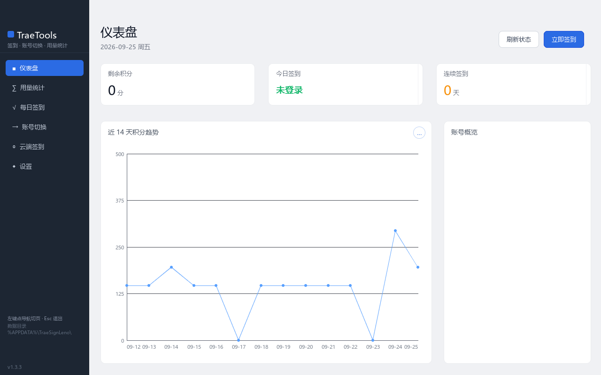
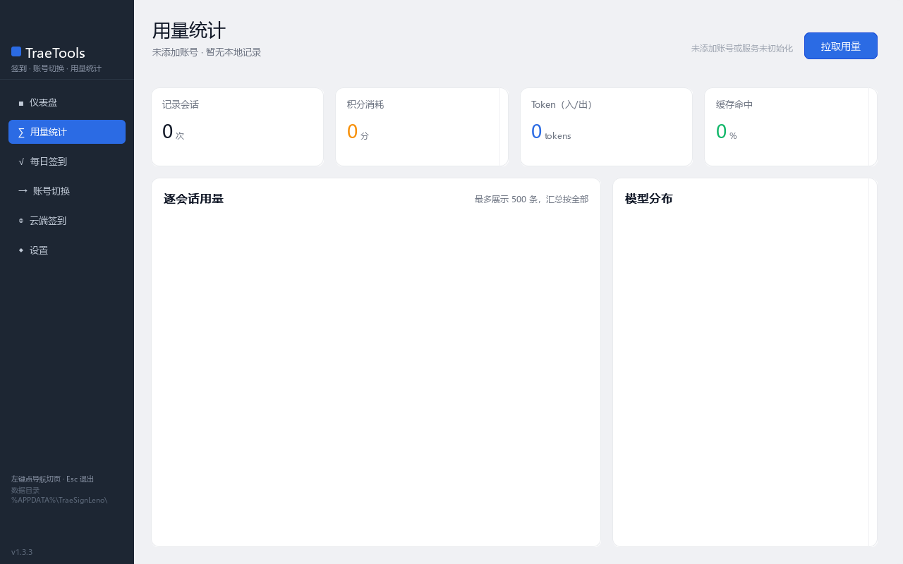
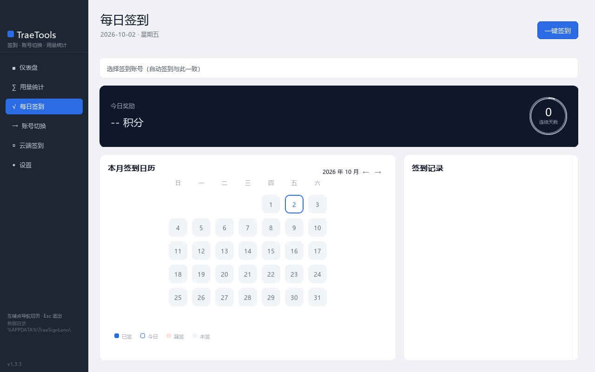
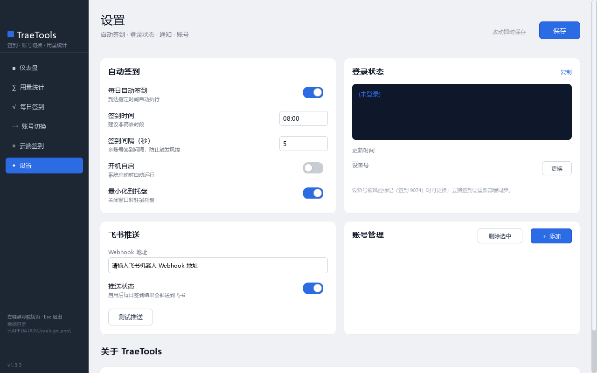

# Leno

**English** | [简体中文](README.md)


Leno is a **scripting language with static type checking** — implemented in C, compiled to bytecode and run on a virtual machine.
Once variables and types are fixed they cannot change; it has built-in GC, coroutines, multithreading, FFI, package management and bytecode packing,
and can also write cross-platform GUIs directly (with a bundled SDL3 module).

Leno was born from a love of and exploration into programming language design; it is not perfect, but it is a joy to work on.



> The image above is a **real running screenshot** of `leno_gui/应用/数据看板/` (captured with its `DSHOT` headless screenshot hook, not a design mockup) —
> a single codebase demonstrates layout driving whole pages, sidebar navigation switching pages, widget composition and custom Canvas drawing.
> To run it: `build\leno.exe leno_gui\应用\数据看板\dashboard.leno`

| | |
| --- | --- |
| Version | 0.1.0 |
| License | MIT |
| Build script | Windows `build.bat` / Linux · macOS `build.sh` |
| Repo size | 20 built-in modules · 46 SDL3 source files · 469 test files · 1016 example files · 67 docs |

---

## About LenoLang

Leno's design goal can be boiled down to one sentence: **writes like a script, checks like a static language**.

Conciseness does not come from cutting features, but from designing boilerplate away:

```leno
// Type inference — no type annotation, yet the type is still pinned down at compile time
var name = "Leno"

// is + => — check, bind and narrow in one step
if v is Array[int] => arr { print(arr.len()) }

// Interpolation, multiple return values and closures are all one-liners
print($"hello {name}, {1 + 2}")
var[int, int](lo, hi) = minMax([3, 1, 9, 7])
var next = make_counter(10)
```

- **Write less**: no semicolons, `var` inference, struct fields declared inline, `face` with explicit `impl` — no ceremonial boilerplate
- **Err less**: static types, nullable `Type?`, safe `as` conversion, exceptions with call stack and operand values
- **Switch languages less**: 20 built-in modules, FFI to call C directly, `threads`/`async` concurrency, SDL3 custom-drawn GUI —
  from a one-line script to a full desktop app, all in this one language

---

## One-Minute Overview

> The snippet below **runs as-is** (save it as `quick.leno`, run `leno quick.leno`) — the output in the comments is the **actual measured result**.

```leno
import maths

// Static types + type inference
var name = "Leno"
const PI = 3.14

// Struct + methods
struct Point {
    int x = 0
    int y = 0
    func dist():float { return maths.sqrt(x * x + y * y) }
}
var p = new Point(x = 3, y = 4)
print(p.dist())                       // 5.0

// Interface + polymorphism
face Shape {
    func area():float
}
struct Circle impl Shape {
    int r = 0
    func area():float { return 3.14 * r * r }
}
var c = new Circle(r = 2)
print(c.area())                       // 12.56

// Multiple return values + destructuring
func minMax(Array[int] arr): [int, int] {
    var lo = arr[0]
    var hi = arr[0]
    for 0 : arr.len() - 1 to i {          // closed interval (inclusive of the last element)
        if arr[i] < lo { lo = arr[i] }
        if arr[i] > hi { hi = arr[i] }
    }
    return lo, hi
}
var[int, int](lo, hi) = minMax([3, 1, 9, 7])
print(lo, hi)                         // 1 9

// Generic struct (type parameters flow precisely along the call chain)
struct Result[T] {
    T data
    bool ok = false
}
func Ok[T](T val): Result[T] { return new Result[T](data = val, ok = true) }
print(Ok[int](42).data)               // 42

// Closures
func make_counter(int start) {
    int count = start
    return func():int { count = count + 1; return count }
}
var next = make_counter(10)
print(next(), next())                 // 11 12

// Null safety + null coalescing
string? maybe = null
print(maybe ?? "anonymous")           // anonymous
print(maybe?.len() ?? 0)              // 0

// Exception handling (e.msg carries location, operand type/value and call stack)
try {
    var z = 1 / 0
} catch e {
    print("出错: " + e.msg)
}

// Chained collection operations
var result = [1, 2, 3, 4, 5]
    .filter(func(any x, any i) { return x % 2 == 0 })
    .map(func(any x, any i) { return x * 10 })
print(result)                         // [20, 40]

print("name = " + name)               // name = Leno
```

Actual output:

```text
5.0
12.56
1 9
42
11 12
anonymous
0
出错: 除零错误：除数为 0
  [操作] 除法 (/)
  [内部] DIV (/)
  [位置] quick.leno:62 (func: <main>)
  [操作数a] type=int, value=1
  [操作数b] type=int, value=0
  [调用栈]
    #0 <main> @ quick.leno:62
[20, 40]
name = Leno
```

---

## Quick Start

### 1. Build

Requires GCC or MinGW (C99).

```bash
build.bat          # Windows
chmod +x build.sh && ./build.sh    # Linux / macOS
```

Artifact: `build/leno` (compiler + VM). If you only want the VM runtime (smaller, without the front end):

```bash
build_vm.bat       # Windows → build/leno_vm.exe
```

### 2. Hello World

```leno
main() {
    print("Hello, Leno!")
}
```

```bash
build/leno hello.leno
```

### 3. Run a GUI App

A bundled SDL3 module; the repo already ships directly runnable apps (dashboard, file manager, minesweeper, Tetris…):

```bash
# From the repo root
build\leno.exe leno_gui\应用\数据看板\dashboard.leno          # multi-feature showcase (layout / widgets / custom Canvas drawing ✓)
build\leno.exe leno_gui\游戏\俄罗斯方块\tetris.leno
```

---

## Language Features

**Type System**
- **Static typing + type inference** — explicit declarations or automatic `var` inference; once a type is fixed it cannot change
- **`const` constants** — immutable bindings, must be initialized at declaration
- **Arbitrary-precision integers** — `int` never overflows; int48 inline + automatic BigInt promotion, transparent to the outside
- **Fixed-width conversions** — `_int32()` / `_int64()` / `_uint32()` / `_uint64()` / `_uint8()` / `_byte()`
- **`alias` type aliases** — simple types, `Array[T]`, `Dict[K,V]`, alias chains
- **Type guards and narrowing** — `is` checks + automatic narrowing inside `if`/`switch` blocks; index narrowing `arr[0] is int`
- **`=>` binding syntax** — `if expr is Type => var` evaluates, binds and narrows in one pass; chainable with `and`
- **Safe conversion `as`** — returns `null` instead of crashing on mismatch
- **Nullable types `Type?`**
- **Native types are annotatable / can be `use`d** — structs declared by a native module's type spec (`DirInfo` / `DirEntry` …)
  can be used as type annotations: `DirInfo d = dirs.stat(p)`, `Array[DirEntry] w = dirs.walk(p)`, and in function parameters/returns,
  script struct fields; they can also be explicitly imported with `use dirs.DirInfo` (the same rule as script module types),
  and a compile-time warning is emitted when a script struct has the same name as a native type

**Structs and OOP**
- **`struct`** — fields, methods, nesting, self-reference
- **Generic struct** — `struct Stack[T]`, `struct Result[T]`
- **`self`** — explicit reference to the instance inside a method (`self` is optional, required when names collide)
- **`face` interfaces** — nominal types + explicit `impl`, compile-time method completeness checks, supports `export face`
- **Multiple face implementations** — `struct Key impl Comparable, Hashable { }`
- **Generic constraints and generic faces** — `func maxBy[T: Comparable](...)`, `face Container[T] { }`
- **`enum`** — auto-incremented or explicit values, essentially `int`
- **Bound method references** — `return item.format`

**Functional**
- **First-class functions / anonymous functions / IIFE / closures** (capture outer variables, independent state per instance)
- **Generic functions** — `func map[T, U](Array[T] arr, func(T):U fn):Array[U]`
- **Default parameters**, **multiple return values**, **forward references**

**Destructuring Declarations**
- Array `var[int, int](a, b) = [10, 20]`, dict `var{"host": string}(host) = config`
- Multiple-return destructuring, partial destructuring (extras dropped / missing filled with `null`), `const` destructuring, `export` destructuring

**Modules and Packages**
- **`import`** — file modules, built-in modules, relative / absolute paths, Chinese and space-containing paths
- **`export`** — explicit export of variables / functions / structs / enums / faces / aliases
- **`use` type import and chain propagation** — `use module.Struct`, passed automatically across layers
- **Circular dependency support**, **module cache (singleton)**, **`.lenocache` compile cache** (with dependency consistency validation)
- **Package management** — `leno.toml`, `leno --init`, `leno --install`

**Concurrency**
- **Multithreading** — `threads` module, `start()` / `join()` / Channel, global variables isolated between threads
- **Async coroutines** — `async` / `await` + event loop
- **Channel** — buffered / unbuffered, Go-style CSP

**Low-level Capabilities**
- **FFI** — call C dynamic libraries and system APIs directly, with no binding layer
- **CStruct** — declarative C struct layout, `packed` / `align` control alignment
- **`&` address-of**, **FFI output parameters** (`&var` or `ffi.write_int`)

**Exceptions**
- **`try-catch-finally`**, nestable, rethrowable with `throw`
- Exception objects carry full `msg` / `file` / `stack` diagnostics (including operand types and actual values)
- Child-thread exceptions propagate to the caller via `join()`

**Operators**
- Safe access `?.`, null coalescing `??`, membership checks `in` / `not in`
- Logical right shift `>>>`; bitwise compound assignments `&=` `|=` `^=` `<<=` `>>=` `>>>=`; compound assignment and `++` / `--`
- Parallel assignment `a, b = b, a`

**Built-in Containers and Strings**
- `Array[T]` / `Dict[K, V]`, `map` / `filter` / `reduce`
- Array slicing `arr[2:8]`, `arr[:5]`, `arr[3:]`; string slicing (UTF-8 character level)
- String interpolation `$"Hello, {name}!"`, raw strings `@"..."`, `format("%02d: %-10s", i, name)`
  - **Both forms of concatenation are valid**: whole-segment interpolation `$"a{b}c"` or explicit per-segment `+ _str(x)` (the repo contains **both**, and per-segment `_str` is a legitimate style, not a sign that "the language lacks interpolation")
  - ⚠ **Do not mix** them within the same output: when mixed, `{x}` inside an ordinary literal is **output verbatim** and the compiler does not warn you (see "`$` only applies to the literal immediately following it" in the tutorial)
- ⚠ **Indexes must be non-negative** — `arr[-1]` throws an index-out-of-bounds error (this is **intentional design**, see `assert/test_string_edge.leno`)

**Engineering**
- **Bytecode** — source → `.lenb` → standalone exe (fully embeddable with `--onefile`)
- **`--debug`** — output all bytecode (main program + all modules) with line numbers
- **GC** — built-in garbage collection, deferred collection does not block the event loop
- **LSP** — `leno_lsp/` language server (completion / go-to-definition / hover)
- **`switch` binary-search optimization** — automatically switches to binary search when there are ≥ 4 cases of the same type (int/float/string)

---

## GUI Ecosystem (LenoSDL3)

`build/leno_module/LenoSDL3/` is a complete cross-platform GUI framework — 46 `sdl_*.leno` files:
about 36 widgets (button / edit box / table / tree / chart / tab / collapsible panel / slider / date…)
plus 10 infrastructure pieces (window / events / batch rendering / fonts and text / theme / layout / drag & drop / tray…).

```leno
import "SDL3" as SDL3
use SDL3.(Event, Renderer)

main() {
    // Configure the window with a Dict: title / w / h / flags…
    var win = SDL3.createWindow({title: "Hello LenoSDL3", w: 800, h: 600})
    if not win.ok { return }

    win.run(
        func(Event e): bool {                       // return false to end the main loop
            if e.isQuit() or e.isWindowClose() { return false }
            return true
        },
        func(Renderer r) {                          // draw every frame (beneath the widgets)
            r.setColor(#141E32FF)
            r.clear()
        }
    )
}
```

A complete runnable version is at `build/leno_module/LenoSDL3/examples/基础示例/simple_window.leno`.

`leno_gui/` contains finished, running apps:

| Directory | Contents |
| --- | --- |
| `控件/` | 14 widget-category demos: button / edit box / label / table / layout / composite widgets / canvas / numeric widgets / chart / selection widgets / overview / **settings panel** / system (the dashboard's two earlier-generation prototypes are also in this directory ✓) |
| `应用/` | 9 complete apps: **dashboard** (a showcase combining layout / widgets / custom Canvas drawing ✓), analog clock, file manager, file search, cache cleaner, desktop pet, IDE layout, PE analyzer, Trae check-in |
| `游戏/` | 6 games: Tetris / plane shooter / minesweeper / tower defense / gomoku / Plants vs. Zombies |
| `特效/` | Fireworks, code rain, water ripples (including a Python baseline comparison) |
| `系统/` | Screenshot tool + global hotkeys |

The other three pages of the same dashboard app (all captured with the headless hook):

| Usage stats (table + line chart) | Daily check-in (`Calendar` widget + Canvas ring) | Settings (form / switches / input boxes) |
| --- | --- | --- |
|  |  |  |

One rendering detail is worth explaining: SDL's 2D primitive pipeline **does no anti-aliasing**, so rounded rectangles and diagonal lines
are changed to "the CPU computes alpha by coverage and writes it into a texture; the GPU only samples" — smoothness comes from the pixel content, not limited by the rasterization algorithm.

---

## Command Line

```bash
build/leno <file.leno>                # run source
build/leno <file.lenb>                # run bytecode
build/leno <file.leno> --list         # arguments after the file are passed to the script as-is (retrieve with _args() in-script)
build/leno -- <file>                  # terminate option parsing (use when the filename starts with -)
build/leno -c <file.leno>             # compile to .lenb (do not execute)
build/leno -p <file.leno>             # pack into a standalone executable (embeds leno_vm)
build/leno -p -o release <file.leno>  # specify the pack output directory (default <source dir>/dist)
build/leno -p --onefile <file.leno>   # single-file pack (native libs and resources embedded)
build/leno --debug <file.leno>        # output all bytecode + line numbers
build/leno --init my-package          # create a new package
build/leno --install                  # install the current project's dependencies (leno.toml)
```

| Option | Description |
| --- | --- |
| `-h, --help` / `-v, --version` | Help / version |
| `--pause` | Pause after execution finishes (to see output when double-clicked) |
| `--debug` / `--debug-out <file>` | Output bytecode / output to a specified file |
| `-c, --compile` | Compile to `.lenb` without executing |
| `-p, --pack` | Compile and pack (exe + dependent native libs copied into the same directory) |
| `-o, --pack-dir <dir>` | Pack output directory, default `<source dir>/dist` |
| `--onefile` | Embed native libs and resources declared in `resource.toml [pack] resources` into the exe |
| `--console` / `--no-console` | Force console / no-console `leno_vm` when packing (Windows; the two are mutually exclusive) |
| `--init [path]` | Create a new package project |
| `--install [path\|git source]` | Install a package or dependency into the global cache (e.g. `gitee:user/repo/pkg-a`) |
| `--` | Terminate option parsing; all following arguments are treated as positional |
| `--no-cache` | Disable the module compile cache (⚠ not listed in the `--help` output, but it does work) |

## Running Tests

```bash
build\leno.exe assert\run_tests.leno              # by default runs assert/ with build\leno.exe
build\leno.exe assert\run_tests.leno build\leno.exe assert   # explicitly specify the interpreter and test directory
```

## Package Management

```bash
leno --init my-package        # generate leno.toml / lib/ src/ native/ examples/ test/
leno --install my-package     # install a local package into the global cache
leno --install gitee:user/my-package
leno --install                # install all dependencies per leno.toml
```

How to write a module (`lib/my-package.leno`):

```leno
export func hello() { print("Hello from my-package!") }
export var VERSION = "0.1.0"
export alias StrList = Array[string]
export struct Config { string host = "localhost"; int port = 8080 }

func _internal() { return "private" }   // without export = private
```

```leno
import "my-package"

main() {
    my-package.hello()
    print(my-package.VERSION)
}
```

---

## Project Structure

```
Leno/
├── src/                        # compiler + VM (C implementation, 89 .c files)
│   ├── parser/ semantic/ codegen/ optimize/ serialize/
│   ├── vm/                     # virtual machine
│   ├── module/                 # 20 built-in modules (io / maths / strings / ffi / threads / asyncs …)
│   ├── package/ platform/ object/ module_symbol_table/
│   └── gc.c  debug.c  module_compiler.c  module_loader.c  module_dispatch.c
├── build/                      # build artifacts
│   ├── leno.exe  leno_vm.exe  leno_vm_gui.exe
│   └── leno_module/            # ★ extension module sources live here (checked in)
│       ├── LenoSDL3/           #   cross-platform GUI (46 sdl_*.leno + docs/ + examples/)
│       ├── LenoWeb/  LenoSqlite/  LenoWin32/
│       └── LenoMusic/  LenoCrypto/  LenoHack/
├── leno_gui/                   # GUI demos and apps (14 widget categories / 9 apps / 6 games / effects)
├── leno_lsp/                   # LSP language server (C implementation + .vsix plugin)
├── assert/                     # assertion tests (469 files, entry point run_tests.leno)
├── examples/                   # example code (1016 files)
├── docs/                       # documentation (67 docs)
├── resources/leno.rc           # Windows resources (icon / version info)
├── sources_core.txt  sources_vm.txt  sources_compiler.txt   # build source file lists
└── build.sh  build.bat  build_vm.sh  build_vm.bat
```

## Built-in Modules

| Module | Description | Module | Description |
| --- | --- | --- | --- |
| `io` | Input/output | `files` | File operations |
| `maths` | Math functions | `dirs` | Directory operations |
| `strings` | String utilities | `jsons` | JSON encode/decode |
| `arrays` | Array utilities | `sockets` | Network sockets |
| `dicts` | Dict utilities | `regexs` | Regular expressions |
| `types` | Type operations | `sys` | System information |
| `times` | Date and time | `ffi` | Foreign function interface |
| `rands` | Random numbers | `cstructs` | C structs |
| `threads` | Multithreading | `asyncs` | Async coroutines |

(There are also two modules, `assert` (test framework) and `structs` (internal).)

## Documentation

**Getting Started and Guides**
- [Leno Tutorial](docs/Leno入门教程.md) (Chinese) — complete syntax reference (with an in-depth type system guide)
- [FAQ](docs/FAQ.md) (Chinese) · [Leno Language Specification Draft](docs/Leno_规范草稿.md) (Chinese) · [Language Improvement Suggestions](docs/Leno语言改进建议.md) (Chinese)
- [Import Guide](docs/import使用指南.md) (Chinese) · [Async/Await Getting Started Guide](docs/async_await入门指南.md) (Chinese)
- [FFI Guide](docs/FFI使用指南.md) (Chinese) · [Threads Guide](docs/threads使用指南.md) (Chinese) · [Concurrency Selection Guide](docs/并发选择指引.md) (Chinese)
- [Package Management and Installation Guide](docs/包管理与安装使用指南.md) (Chinese) · [Single-File Packing Guide](docs/单文件打包使用指南.md) (Chinese)
- [Encryption Algorithm Examples Guide](docs/加密算法示例指南.md) (Chinese)

**Module API Reference** (`docs/module_*.md`)
- [io](docs/module_io.md) (Chinese) · [maths](docs/module_maths.md) (Chinese) · [strings](docs/module_strings.md) (Chinese) · [arrays](docs/module_arrays.md) (Chinese) · [dicts](docs/module_dicts.md) (Chinese)
- [types](docs/module_types.md) (Chinese) · [times](docs/module_times.md) (Chinese) · [rands](docs/module_rands.md) (Chinese) · [files](docs/module_files.md) (Chinese) · [dirs](docs/module_dirs.md) (Chinese)
- [jsons](docs/module_jsons.md) (Chinese) · [sockets](docs/module_sockets.md) (Chinese) · [regexs](docs/module_regexs.md) (Chinese) · [sys](docs/module_sys.md) (Chinese)
- [ffi](docs/module_ffi_api.md) (Chinese) · [cstructs](docs/module_cstructs.md) (Chinese) · [threads](docs/module_threads_api.md) (Chinese) · [asyncs](docs/module_asyncs.md) (Chinese)

**GUI (LenoSDL3)**
- [Common APIs and Pitfall Quick Reference](build/leno_module/LenoSDL3/docs/SDL3常用API与易踩坑速查.md) (Chinese) — layout `{basis, grow}` semantics, drawing-layer order, anti-aliasing scope
- [Widget Optimization Checklist](build/leno_module/LenoSDL3/docs/SDL3控件优化清单.md) (Chinese)
- [Pixel Direct-Write Rendering Optimization](docs/LenoSDL3像素直写渲染优化.md) (Chinese) · [Diagnosing Flicker Caused by Excessive Clipping](docs/LenoSDL3_裁剪过多导致闪烁排查记录.md) (Chinese) · [Table Method Table Break compiler bug](docs/LenoSDL3_Table方法表断裂编译器bug排查记录.md) (Chinese)
- Regression cases: `build/leno_module/LenoSDL3/examples/图形绘制/` (anti-aliasing, clock) + `其他测试/` (drawing order, layout dump)

**Performance and Implementation Notes**
- [Performance Optimization Notes](docs/性能优化记录.md) (Chinese) · [Performance Test Summary (Leno vs Python)](docs/性能测试总结_Leno_vs_Python.md) (Chinese) · [Bytecode Optimization Analysis](docs/字节码优化分析.md) (Chinese)
- [Differences Between Register-based and Stack-based](docs/寄存式与栈式的差异清单.md) (Chinese) · [JIT Implementation and Debugging Notes](docs/JIT实现与调试记录.md) (Chinese) · [GC and Allocation Optimization (TODO)](docs/待办_GC与分配优化.md) (Chinese)

**Roadmap**
- [TODO and Roadmap](docs/待办与路线图.md) (Chinese) · [Usability Pain Points (TraeSign Port Record)](docs/待办_易用性痛点（TraeSign 移植实录）.md) (Chinese) · [Single Source of Truth and Convergence of Duplicate Implementations](docs/待办_单一事实来源与重复实现收敛.md) (Chinese)

## License

[MIT](LICENSE)
